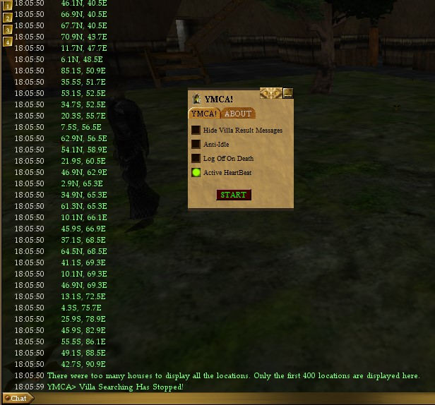

# YMCA

YMCA a [Decal](http://www.decaldev.com/) utility plugin for use with private Asheron's Call emulation servers

<picture>
 <source media="(prefers-color-scheme: dark)" srcset="YMCA.jpg">
 <source media="(prefers-color-scheme: light)" srcset="YMCA.jpg">
 
</picture>

# Features include:

* Anti Client idle
* Logout on death
* Play sound on when a villa becomes open for purchase

https://github.com/FtuoilXelrash/YMCA/assets/37750686/171a4051-45a5-4707-8757-148d968143f3

# Installing

* See the [Releases](https://github.com/FtuoilXelrash/YMCA/releases/tag/v2.9.0) for the latest release. 
* Install as you normally would for any Decal plugin distributed as a DLL.
* Final Release 10/01/2008 Version 2.9.0

# Prerequisites
* [Decal](http://www.decaldev.com/) 
* [ACEmulator](http://emulator.ac/)

# Contact
- Creator
[Ftuoil Xelrash Discord Channel](https://discord.gg/G8mfZH2TMp)

# Disclaimer
Asheron's Call was a registered trademark of Turbine, Inc. and WB Games Inc which has since expired.

ACEmulator is not associated or affiliated in any way with Turbine, Inc. or WB Games Inc.
